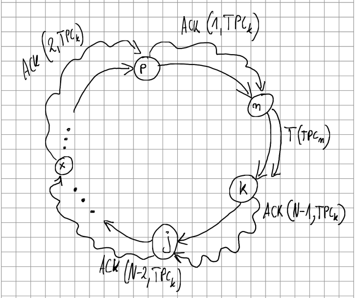

# Algorytm detekcji zagubienia tokenu w przetwarzaniu typu Token - Ring 

## Model:
- Kanały zawodne FIFO; ~nie muszą być
- N procesów;
- Komunikacja (wszystkie wiadomości w tym Token) - przesyłane w jednym kierunku (Ring);
- Nie ma procesów wyróżnionych;
- Tokeny są podpisywane przez procesy (np.: nadawca tokenu: n), które je wysyłają ze swoim ID; ~ niepotrzebne
- Tylko procesy posiadające aktualny token mogą wejść do sekcji krytycznej;
- Procesy znają oszacowany czas propagacji nieblokowanej wiadomości przez pierścień. 

## Komunikacja:
W kanale przesyłane są 2 typy wiadomości:
- Token - w skrócie opisywany T(n,m), gdzie n to ID procesu, który wysyła token, a m to liczba wejść do sekcji krytycznej ostatnio widziana przez proces n;
- Acknowledge - w skrócie opisywana ACK(n,m), gdzie n to ID procesu, który wysyła acknowledge, a m to liczba wejść do sekcji krytycznej ostatnio widziana przez proces n;

## Opis:
Procesy wysyłają sobie token, a po otrzymaniu tokenu wysyłają wiadomość ACK.  
Procesy zapamiętują liczbę wejść do sekcji krytycznej jako CSC (Critical Section Counter) w celu zidentyfikowania przestarzałych wiadomości.  
Wiadomości T lub ACK z nieprawidłową (przestarzałą) liczbą wejść do sekcji krytycznej są ignorowane.  
Procesy przesyłają dalej (nieblokująco) wiadomości ACK, sprawdzane są tylko wiadomości ACK dotyczące siebie i następnika.  

## Rysunek poglądowy:

## Szczegółowy opis algorytmu:
### Oznaczenia:
- n - ID procesu (dowolnego - aktualnie rozważanego);
- CSC - Critical Section Counter - licznik wejść do sekcji krytycznej ostatnio widziany przez rozważany proces;
- T - token, gdzie T(x,m) oznacza token wysłany przez proces o ID x z CSC (widzianym z procesu x) wynoszącym m;
- ACK - wiadomość acknowledge, gdzie ACK(x,m) oznacza ACK wysłane przez proces o ID x z CSC (widzianym z procesu x) wynoszącym m;

### Algorytm:
- Procesy są w stanie wejść do strefy krytycznej jedynie podczas posiadania tokenu.
- Każdy proces cały czas nasłuchuje wiadomości pochodzacych od swojego poprzednika w pierścieniu i przetrzymuje wartość CSC.
- Proces n, jeżeli [!]:
    - Otrzyma Token T(n-1,m) - porównuje m z CSC i jeżeli:
        - m < CSC, token jest przestarzały - wiadomość jest ignorowana/usuwana.
        - m >= CSC, token jest nowy - CSC w procesie jest aktualizowane do wartości m, a następnie:
            - Proces n przestaje oczekiwać na ACK(n+1,m), ponieważ dostał z powrotem token  
            (proces n ma pewność, że token przeszedł przez cały pierścień).
            - Jeżeli proces n nie potrzebuje wejścia do sekcji krytycznej, to przesyła token dalej (wysyła T(n,CSC) do procesu n+1) i oczekuje wiadomości ACK(n+1,m).
            - Jeżeli proces n chce wejść do sekcji krytycznej to zwiększa wartość CSC o 1, przesyła wiadomość ACK(n,CSC) w przód przez cały ring, aby poinformować proces n-1, że token został pomyślnie przesłany i wchodzi do sekcji krytycznej.   
    - Otrzyma ACK(n,m) - porównuje m z CSC i jeżeli:
        - m < CSC, wiadomość ACK jest przestarzała  - wiadomość jest ignorowana/usuwana.
        - m = CSC, wiadomość ACK jest nowa, że wymiana tokenu zakończyła się pomyślnie.  
        Note: Jeżeli mamy kolejność wiadomości FIFO to nie dostaniemy ACK(n,m), gdzie m > CSC, gdyż CSC to największa liczba wejść do sekcji krytycznej jaką widział proces n w momencie wysyłania wiadomości ACK.         
    - Otrzyma wiadomość ACK(x,m), gdzie x!=n, to jeżeli
        - m < CSC, wiadomość jest ignorowana/usuwana.
        - m >= CSC, oczekiwanie na ACK(n,m) jest przerywane, CSC przypisywana jest wartość m, a wiadomość propagowana jest dalej(oznacza to, że potwierdzenie z n do n+1 zostało zgubione lub niewygenerowane lub wyprzedzone przez potwierdzenie z n+k do n+k+1, gdzie k>1, co również potwierdza dostarczenie tokenu)
    - Nie otrzyma ACK(n+1,m) w ustalonym czasie propagacji wiadomości przez cały pierścień podczas oczekiwania na potwierdzenie odebrania tokenu, to:
        - Retransmituje token T(n,CSC)
        - Zaczyna oczekiwanie na wiadomość ACK(n+1,CSC) na nowo.
    
## Aktualny stan algorytmu:
- Init 
## Pytania:
- Czy razem z Tokenem należy wysyłać ID procesu?  
Opis: Jeżeli token możemy tylko otrzymać od poprzednika, to interesuje nas tylko CSC.  
Odpowiedź: Prawdopodobnie nie - do przetestowania.

- Jak zauważane jest zgubienie tokenu?  
Odpowiedź: Proces który wysłał Token nie otrzymał ACK, co może oznaczać zgubienie ACK lub zgubienie tokenu, dlatego ponowna retransmisja tokenu odtwarza token przy domniemaniu jego zgubienia. Dwóch tokenów w ringu nie będzie, ponieważ przestarzałe tokeny za pomocą CSC są ignorowane. 

- Czy potrzebne jest uszeregowanie wiadomości FIFO w kanale?  
Opis: Jeżeli CSC definiuje nam, czy wiadomości ACK/token są przestarzałe to czy kolejność ACK ma znaczenie?  
Odpowiedź: Prawdopodobnie rozluźnienie tego założenia może spowodować zbędne retransmisje tokenu - do przetestowania.

- Czy poprawnie są identyfikowane przestarzałe wiadomości?  
Opis: Czy przestarzała wiadomość to m < CSC czy m <= CSC?  
Odpowiedź: Chyba jest pewnego rodzaju błąd, jeżeli dostaniesz retransmisje tokena od poprzednika, a sam nie wszedłeś do sekcji krytycznej to m == CSC, a następne procesy mogą być w sekcji / lub nie, ale w każdym razie może być więcej tokenów wtedy z różnym lub identycznym CSC.  
Rozwiązanie? - Może warto CSC zwiększać o 1 zawsze, bez względu na wejście do sekcji krytycznej - zmiana definicji CSC z liczba wejść do CS na liczba przekazań tokenu.

- Czy wysłanie ACK oprócz trafienia do procesu, od którego dostaliśmy token musi trafiać do naszego procesu, który to ACK wysłał?
Opis: Ta wiadomość ostatnio wysyłana daje tylko i wyłącznie "pewność", że przekazanie się powiodło i nie będzie zbędnych transmisji przestarzałego tokenu,  
ale jeżeli nie będzie retransmisji przestarzałego tokenu i tak (bo ACK dostał proces, który nam wysłał token) to co nam daje ta "pewność".

Autorzy:
- Julian Helwig 139940
- Seweryn Kopeć 139959

Specjalność: Systemy rozproszone  
Rok: 2022
